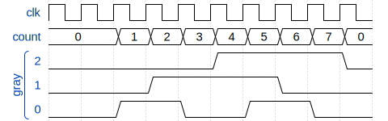
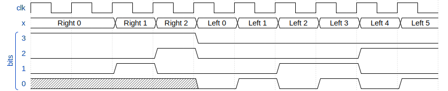

# Clash-WaveDrom

Generate wave diagrams from Clash with [WaveDrom](https://wavedrom.com/).

## Examples

It can show records with labeled waves (nested records work as you'd expect).

```haskell
data Gray n = Gray
  { count  :: Unsigned n
  , gray :: BitVector n
  }
  deriving stock Generic
  deriving anyclass (NFData, ToWave)

readmeSignal :: Signal System (Gray 3)
readmeSignal =
  let count = register 0 (countSucc <$> count)
      gray  = (\x -> (x `shiftR` 1) `xor` x) . bitCoerce <$> count
  in  Gray <$> count <*> gray
```

```haskell
renderToSVG "gray.svg" (wavedromWithReset 10 "" readmeSignal)
```



---------------

It can render the `Show` representation alongside the `BitPack` representation
very easily.

```haskell
eitherSignal :: Signal System (Either (Index 8) (Index 3))
eitherSignal = let x = register (Right 0) (countSucc <$> x) in x
```

```haskell
renderToSVG
  "either.svg"
  (wavedromWithClock 10 "" (WithBits <$> eitherSignal))
    { config = object ["hscale" .= (2 :: Int)]
    }
```



Observe the undefined bits being handled correctly.

---------------
